# Brand Growth Intelligence Data Design

## Status

Working proposal. This document defines the data foundation needed for the PepsiCo Brand Growth Intelligence Layer described in `docs/product/BRAND_GROWTH_INTELLIGENCE_VISION.md`.

The design is intentionally not limited to the data available in the current prototype. It describes what the system should know, how that knowledge should be defined, and how the data should relate so that PepsiCo can build a differentiated intelligence layer over time. Better Brand Equity remains the V1 diagnostic spine; additional data families exist to explain, challenge, and action the BBE diagnosis.

## Design Stance

The bottom-up data design is the right next move, but it should be decision-backed rather than source-backed.

The system should not start with "what files do we have?" It should start with the decisions the product must support:

- What does the BBE diagnosis say about brand equity health?
- What may explain or complicate that BBE read?
- What is constraining the brand's ability to turn equity into growth?
- Is the constraint mental availability, distinctive memory structures, physical availability, machine availability, portfolio coverage, or execution momentum?
- What evidence supports that read?
- What is missing?
- What action should the team consider?
- What follow-up signal would prove or challenge the action?

Then every source can be mapped into that decision system.

## North-Star Data Contract

The future product should have three levels of data objects.

### 1. Raw Source Assets

Unmodified files, extracts, transcripts, reports, exports, APIs, and research outputs.

Use:

- Auditability.
- Reprocessing.
- Source citations.
- Data lineage.

Examples:

- BBE exports.
- Growth Navigator workbooks.
- Mental Availability / CEP reports.
- Retail/ecommerce extracts.
- Creative asset measurement.
- Media reach/frequency exports.
- Product feeds.
- AI visibility studies.
- Workshop transcripts.

### 2. Canonical Facts

Normalized facts at stable grains.

Use:

- Deterministic diagnosis.
- Comparisons.
- Evidence ledger.
- Data quality checks.
- Portfolio analysis.

Examples:

- Brand metric fact.
- Mental availability metric fact.
- CEP association fact.
- Physical availability fact.
- Distinctive asset fact.
- Machine availability fact.
- Treatment outcome fact.

### 3. Product Serving Records

Opinionated packets optimized for the app experience.

Use:

- Brand pages.
- Chat and voice context.
- Executive summaries.
- Roadmaps.
- Portfolio views.

Examples:

- Brand Health Record.
- Growth Availability Record.
- Evidence Readiness Record.
- Brand Diagnosis Result.
- Treatment Plan Record.
- Portfolio Growth Record.

## Data Principles

1. Keep raw, canonical, and serving layers separate.
2. Every fact must carry source, period, market, category lens, and confidence metadata.
3. AI outputs are never canonical facts.
4. Deterministic rules diagnose; AI explains and interrogates.
5. BBE is the diagnostic spine for V1 serving records.
6. Connected systems explain, challenge, and action the BBE diagnosis; they do not replace it.
7. HBG is an important organizing philosophy, but source evidence must still prove each claim.
8. Different and distinctive are separate constructs.
9. Physical availability and machine availability need their own evidence packets.
10. Missing evidence is a first-class data state.
11. The data model must support brand, category, market, and portfolio views without making the V1 product a comparison dashboard.

## Source Inventory

### 1. Identity, Taxonomy, and Governance

Purpose:

Define the stable language of the system.

Needed sources:

- Brand master.
- Category taxonomy.
- Market/country taxonomy.
- Segment and subcategory taxonomy.
- Brand hierarchy.
- Parent brand / sub-brand / product-line relationships.
- Portfolio role definitions.
- Category lens definitions.
- Source system registry.
- Data refresh calendar.
- Methodology ownership registry.

Key definitions:

- Brand.
- Market.
- Category.
- Category lens.
- Portfolio role.
- Reporting period.
- Source system.
- Data owner.
- Methodology owner.

Why it matters:

Without this layer, every analysis risks comparing unlike things or treating a temporary lens as permanent brand truth.

### 2. BBE Equity Evidence

Purpose:

Measure brand equity health and its movement over time.

Needed sources:

- BBE metric exports.
- BrandZ typology.
- PowerShare.
- Perceived Value source grid from the Pricing Power source metric.
- S/M/D metric facts.
- Demand Power and Perceived Value facts.
- Benchmark bands.
- Ahead status.
- Momentum status.
- Source slides/pages.

Core constructs:

- Demand Power.
- Perceived Value, with Pricing Power preserved as the source metric name.
- Meaningful.
- Different.
- Salient.
- BrandZ typology.
- PowerShare.
- Benchmark status.
- Momentum.

Primary grains:

- Brand x market x category lens x period x metric.
- Brand x market x category lens x period x typology.

Primary use:

- Brand Health Panel.
- Diagnosis rules.
- Evidence Readiness.
- Trend and momentum reads.
- Treatment follow-up signals.

### 3. Mental Availability and CEP Evidence

Purpose:

Operationalize How Brands Grow through measurable memory structures.

Needed sources:

- Mental Availability Tracking reports.
- Category Entry Point research.
- CEP relevance scoring.
- CEP mental competition scoring.
- Brand-to-CEP association data.
- Mental advantages and disadvantages.
- Buyer/non-buyer splits.
- Sales penetration or buyer penetration.

Core constructs:

- Mental Market Share.
- Mental Penetration.
- Network Size.
- Share of Mind.
- Category Entry Point.
- CEP relevance.
- CEP competition.
- Mental advantage.
- Mental disadvantage.
- Buyer/non-buyer mental gap.

Primary grains:

- Brand x market x category x period.
- Brand x market x category x period x CEP.
- CEP x market x category x period.
- Brand x buyer status x market x category x period.

Primary use:

- Growth Availability Read.
- CEP Explorer.
- Mental Availability diagnosis.
- Portfolio CEP coverage.
- Build/defend/avoid guidance.
- Light/non-buyer growth reads.

Critical guardrail:

CEP overlap is not cannibalization proof. It is mental territory evidence.

### 4. Distinctive Memory Structure Evidence

Purpose:

Measure whether the brand is easy to recognize as itself.

Needed sources:

- Distinctive asset measurement.
- Branding quality assessment.
- Creative testing.
- Packaging recognition.
- Logo/color/shape/character/audio asset tracking.
- Asset consistency audits.
- Creative metadata.
- Media creative rotation metadata.

Core constructs:

- Distinctive asset.
- Asset fame.
- Asset uniqueness.
- Asset linkage to brand.
- Asset consistency.
- Branding quality.
- Creative recognition.
- Packaging recognition.

Primary grains:

- Brand x market x period x asset.
- Brand x market x period x creative execution.
- Brand x market x period x pack or design system.

Primary use:

- Different vs Distinctive guardrail.
- Creative strategy.
- Branding quality diagnosis.
- Machine/human recognizability.
- Treatment selection for asset strengthening.

Critical guardrail:

BBE Different is not the same as distinctive asset strength. Different is an equity perception metric. Distinctiveness is recognizability and brand linkage.

### 5. Physical Availability Evidence

Purpose:

Measure whether the brand is easy to find and buy.

Needed sources:

- Growth Navigator.
- Distribution.
- ACV / weighted distribution.
- Retailer presence.
- Shelf placement.
- Assortment.
- Pack and format availability.
- Out-of-stock / in-stock data.
- E-commerce search rank.
- Digital shelf content.
- Retail media data.
- Price-pack architecture.
- Promo availability.
- Channel coverage.

Core constructs:

- Presence.
- Prominence.
- Portfolio availability.
- Search availability.
- Shelf availability.
- Retailer coverage.
- Pack availability.
- Buyability.
- Price-pack fit.

Primary grains:

- Brand x market x channel x retailer x period.
- SKU or pack x retailer x market x period.
- Brand x digital shelf x retailer x period.
- Brand x store/channel x period.

Primary use:

- Growth Navigator bridge.
- Physical Availability read.
- Availability constraint diagnosis.
- Treatment path selection.
- Commercial handoff.

Critical guardrail:

Physical availability is not inferred from equity data. It requires commercial, channel, retail, or ecommerce evidence.

### 6. Machine Availability / AI Discoverability Evidence

Purpose:

Measure whether the brand is easy for AI systems, search engines, retailer algorithms, and answer engines to retrieve, understand, trust, and recommend.

Needed sources:

- AI answer visibility audits.
- Search engine visibility.
- Retail search visibility.
- Product feed completeness.
- Structured data/schema markup.
- Retail API integration status.
- First-party content coverage.
- Reviews and ratings.
- Knowledge graph/entity clarity.
- Source authority.
- Product claim consistency.
- Direct path-to-purchase availability.

Core constructs:

- AI visibility.
- AI recommendation presence.
- AI answer accuracy.
- Structured data completeness.
- Entity clarity.
- Retail feed quality.
- Source authority.
- Review signal quality.
- Direct purchase readiness.

Primary grains:

- Brand x market x platform x period.
- Brand x query/prompt x platform x period.
- SKU/product x retailer/platform x period.
- Brand x source/domain x period.

Primary use:

- 2026 availability extension.
- AI visibility strategy.
- Digital discoverability treatment paths.
- Content/data readiness.
- Retail API/direct-to-cart actions.

Critical guardrail:

Machine Availability is a modern applied extension of availability. Do not present it as an official How Brands Grow law unless methodology owners approve that language.

### 7. Buyer Base, Penetration, and Behavioral Evidence

Purpose:

Connect brand memory and availability to buyer-base growth.

Needed sources:

- Household penetration.
- Buyer penetration.
- Repeat rate.
- Purchase frequency.
- Light/heavy buyer splits.
- Category buyer universe.
- Trial/retrial.
- Leakage/lapsing.
- Panel data.
- Retail scanner data.
- Loyalty/card data where appropriate.

Core constructs:

- Sales penetration.
- Buyer penetration.
- Light buyers.
- Heavy buyers.
- Non-buyers.
- Trial.
- Repeat.
- Purchase frequency.
- Category buyer reach.

Primary grains:

- Brand x market x category x period.
- Brand x buyer segment x market x period.
- Brand x retailer/channel x period.

Primary use:

- HBG growth read.
- Mental versus sales penetration comparison.
- Momentum validation.
- Portfolio growth analysis.

Critical guardrail:

Do not over-focus on heavy buyers if the growth question is penetration or light-buyer reach.

### 8. Media, Reach, and Communications Evidence

Purpose:

Understand whether brand-building activity can plausibly build memory structures.

Needed sources:

- Media plan.
- Reach/frequency.
- Continuity.
- Channel mix.
- Spend.
- Creative rotation.
- Campaign objectives.
- Creative test results.
- Branding quality.
- Attention/engagement diagnostics where available.

Core constructs:

- Category-buyer reach.
- Light-buyer reach.
- Continuity.
- Branded reach.
- Creative cut-through.
- Message/CEP linkage.
- Asset consistency.

Primary grains:

- Brand x market x campaign x period.
- Brand x market x media channel x period.
- Creative execution x period x market.

Primary use:

- Diagnose lower mental penetration / higher network size patterns.
- Assess whether media is too narrow.
- Assess whether messaging is too narrow.
- Link treatments to execution prerequisites.

### 9. Product, Pack, Price, and Proposition Evidence

Purpose:

Understand whether the brand promise, product experience, pack architecture, and value cues support growth.

Needed sources:

- Product portfolio.
- SKU/pack list.
- Pack architecture.
- Price ladder.
- Promo strategy.
- Product claims.
- Sensory/product testing.
- Consumer reviews.
- Concept/proposition testing.
- Innovation pipeline.

Core constructs:

- Product truth.
- Proposition clarity.
- Reason to believe.
- Pack availability.
- Price-pack fit.
- Value cue.
- Quality cue.
- Experience delivery.

Primary grains:

- Brand x market x product/SKU x period.
- Brand x market x proposition/concept x period.
- Brand x market x claim x period.

Primary use:

- Price-Value Vulnerability read.
- Proposition treatment path.
- Product experience check.
- Machine availability content quality.

Critical guardrail:

Perceived Value can indicate broad equity-based value perception. It cannot prescribe SKU price moves. Source files may still use the Pricing Power metric name.

### 10. Portfolio and Category Strategy Evidence

Purpose:

Help PepsiCo manage a healthy portfolio that catches buyers as needs, occasions, and life contexts evolve.

Needed sources:

- Portfolio role definitions.
- Brand hierarchy.
- Category/subcategory coverage.
- CEP coverage by brand.
- Need-state coverage.
- Occasion coverage.
- Market/category growth pools.
- Portfolio whitespace.
- Brand role strategy.
- Commercial priorities.

Core constructs:

- Portfolio role.
- Category coverage.
- CEP coverage.
- Mental competition.
- Whitespace.
- Overlap.
- Growth pool.
- Role conflict.

Primary grains:

- Portfolio x market x category x period.
- Brand x portfolio role x market x period.
- CEP x portfolio x market x period.

Primary use:

- Portfolio Growth Intelligence.
- Brand role interpretation.
- Market/category planning.
- Healthy portfolio read.

Critical guardrail:

Portfolio overlap is not automatically cannibalization. It is a prompt for strategic review.

### 11. Treatment, Action, and Follow-Up Evidence

Purpose:

Connect diagnosis to action and action to learning.

Needed sources:

- Treatment library.
- Diagnosis-treatment links.
- Treatment plan selections.
- Owner notes.
- Action status.
- Execution milestones.
- Follow-up BBE waves.
- Follow-up Mental Availability waves.
- Follow-up GN/commercial signals.
- Campaign/activation execution data.
- Pilot outcomes.

Core constructs:

- Treatment.
- Treatment family.
- Action plan.
- Owner.
- Dependency.
- Expected metric movement.
- Follow-up signal.
- Proof signal.
- Challenge signal.
- Outcome.

Primary grains:

- Brand x treatment x plan x period.
- Brand x follow-up signal x period.
- Treatment x diagnosis.

Primary use:

- Roadmap.
- Learning loop.
- Treatment effectiveness.
- Governance.

### 12. Human Judgment, Governance, and Knowledge Evidence

Purpose:

Make the system improve without letting AI silently rewrite the methodology.

Needed sources:

- Expert comments.
- Rule edits.
- Treatment edits.
- Calibration decisions.
- Pilot feedback.
- Meeting takeaways.
- Wiki docs.
- Learn modules.
- Prompt policies.
- Persona definitions.
- Methodology guardrails.

Core constructs:

- Expert note.
- Decision.
- Accepted change.
- Rejected change.
- Version.
- Methodology owner.
- Rationale.
- Source citation.
- AI run.
- Human approval.

Primary grains:

- Config item x version.
- Brand x feedback event.
- LLM run x prompt x source packet.
- Meeting x brand x decision.

Primary use:

- No Magic.
- Auditability.
- Rule authoring.
- Change queue.
- Version history.
- Learning system.

## Canonical Entities

### Brand

Stable commercial brand entity.

Relationships:

- Belongs to parent company/portfolio.
- Can have sub-brands, product lines, packs, and SKUs.
- Appears in one or more markets and categories.
- Has many metric facts, diagnosis results, treatment plans, and availability packets.

Key fields:

- `brandId`
- `brandName`
- `parentBrandId`
- `brandLevel`
- `portfolioId`
- `status`
- `aliases`

### Market

Geographic market or country.

Relationships:

- Has many categories.
- Has brand-market participation records.
- Defines source availability and comparison rules.

Key fields:

- `marketId`
- `marketName`
- `region`
- `currency`
- `language`

### Category

Competitive/category context.

Relationships:

- Has many category lenses.
- Has many brands.
- Has many CEPs.
- Has benchmark definitions.

Key fields:

- `categoryId`
- `categoryName`
- `parentCategoryId`
- `description`

### Category Lens

Specific analytical lens used for comparisons.

Relationships:

- Applies to a market and category.
- Defines valid and invalid interpretations.
- Used by Brand Health Records and metric facts.

Key fields:

- `categoryLensId`
- `marketId`
- `categoryId`
- `validFor`
- `notValidFor`
- `knownBlindSpots`

### Period

Time window for facts.

Relationships:

- Used by every fact table.
- Can represent wave, quarter, MAT, campaign period, or custom study period.

Key fields:

- `periodId`
- `periodLabel`
- `periodType`
- `startDate`
- `endDate`
- `sourcePeriodLabel`

### Source System

Origin of a fact.

Relationships:

- Provides raw assets.
- Produces facts.
- Has data owner, refresh cadence, confidence defaults, and access rules.

Key fields:

- `sourceSystemId`
- `name`
- `owner`
- `refreshCadence`
- `accessClassification`
- `methodologyNotes`

### Source Asset

Raw file, API extract, report, transcript, or document.

Relationships:

- Belongs to a source system.
- Supports many evidence items.
- Can be parsed into many facts.

Key fields:

- `sourceAssetId`
- `sourceSystemId`
- `fileName`
- `sourcePath`
- `createdAt`
- `periodId`
- `checksum`
- `confidentiality`

### Evidence Item

Atomic evidence unit shown to users.

Relationships:

- Points to one or more facts or source assets.
- Supports or complicates diagnoses, treatments, and AI answers.

Key fields:

- `evidenceItemId`
- `evidenceType`
- `statement`
- `sourceAssetId`
- `sourceLocator`
- `factRefs`
- `confidence`
- `caveat`

## Canonical Fact Families

### Brand Metric Fact

Use for BBE and other brand-level metrics.

Grain:

`brand x market x category lens x period x metric`

Key fields:

- `brandId`
- `marketId`
- `categoryLensId`
- `periodId`
- `metricId`
- `value`
- `displayValue`
- `benchmarkValue`
- `categoryBand`
- `aheadStatus`
- `momentumStatus`
- `sourceAssetId`
- `sourceLocator`

### Mental Availability Metric Fact

Use for MMS, Mental Penetration, Network Size, Share of Mind, and comparable metrics.

Grain:

`brand x market x category x period x metric`

Key fields:

- `brandId`
- `marketId`
- `categoryId`
- `periodId`
- `metricId`
- `value`
- `expectedValue`
- `deviation`
- `buyerStatus`
- `sourceAssetId`
- `sourceLocator`

### CEP Association Fact

Use for brand-to-CEP advantages and disadvantages.

Grain:

`brand x market x category x period x CEP`

Key fields:

- `brandId`
- `marketId`
- `categoryId`
- `periodId`
- `cepId`
- `observedAssociation`
- `expectedAssociation`
- `differencePoints`
- `associationStatus`
- `advantageDisadvantage`
- `sourceAssetId`
- `sourceLocator`

### CEP Definition Fact

Use for relevance, competition, and portfolio mapping.

Grain:

`CEP x market x category x period`

Key fields:

- `cepId`
- `marketId`
- `categoryId`
- `periodId`
- `label`
- `wFrameworkType`
- `relevanceScore`
- `relevanceBand`
- `competitionBand`
- `linkedBrands`
- `freeOrContested`
- `sourceAssetId`
- `sourceLocator`

### Distinctive Asset Fact

Use for recognizability and brand linkage.

Grain:

`brand x market x period x asset`

Key fields:

- `brandId`
- `marketId`
- `periodId`
- `assetId`
- `assetType`
- `fame`
- `uniqueness`
- `brandLinkage`
- `consistency`
- `recognitionScore`
- `sourceAssetId`
- `sourceLocator`

### Physical Availability Fact

Use for retail, channel, shelf, and ecommerce availability.

Grain:

`brand or product x market x channel/retailer x period`

Key fields:

- `brandId`
- `productId`
- `marketId`
- `channelId`
- `retailerId`
- `periodId`
- `presence`
- `prominence`
- `distribution`
- `inStockRate`
- `searchRank`
- `contentCompleteness`
- `packAvailability`
- `sourceAssetId`
- `sourceLocator`

### Machine Availability Fact

Use for AI/search/retrieval discoverability.

Grain:

`brand or product x platform x query/prompt x market x period`

Key fields:

- `brandId`
- `productId`
- `platformId`
- `queryId`
- `marketId`
- `periodId`
- `visibilityStatus`
- `recommendationRank`
- `answerAccuracy`
- `sourceCitationQuality`
- `structuredDataCompleteness`
- `retailPathPresence`
- `sourceAssetId`
- `sourceLocator`

### Buyer Behavior Fact

Use for penetration, trial, repeat, frequency, and buyer-base reads.

Grain:

`brand x market x category x period x buyer segment`

Key fields:

- `brandId`
- `marketId`
- `categoryId`
- `periodId`
- `buyerSegmentId`
- `salesPenetration`
- `buyerPenetration`
- `trial`
- `repeat`
- `purchaseFrequency`
- `lightBuyerShare`
- `heavyBuyerShare`
- `sourceAssetId`
- `sourceLocator`

### Media and Communications Fact

Use for reach, continuity, branded reach, and campaign prerequisites.

Grain:

`brand x market x campaign x period x channel`

Key fields:

- `brandId`
- `marketId`
- `campaignId`
- `periodId`
- `channelId`
- `reach`
- `frequency`
- `spend`
- `continuity`
- `targetingBreadth`
- `brandedReach`
- `creativeAssetIds`
- `messageCepIds`
- `sourceAssetId`
- `sourceLocator`

### Treatment Outcome Fact

Use for learning whether actions created movement.

Grain:

`brand x treatment x follow-up signal x period`

Key fields:

- `brandId`
- `treatmentId`
- `planId`
- `periodId`
- `signalId`
- `expectedDirection`
- `observedValue`
- `observedMovement`
- `outcomeRead`
- `sourceAssetId`
- `sourceLocator`

## Serving Records

### Brand Health Record

V1 serving object for brand diagnosis.

Contains:

- Brand identity.
- Category lens.
- BBE metrics.
- Trends.
- Occasions.
- Growth Navigator bridge where available.
- Diagnosis IDs or computed diagnosis result.
- Source files.

### Growth Availability Record

Future serving object for the intelligence layer.

Contains:

- Mental Availability read.
- Distinctive Memory Structure read.
- Physical Availability read.
- Momentum read.
- Machine Availability read.
- Portfolio context read.
- Growth constraint hypothesis.
- Evidence readiness by pillar.
- Missing data by pillar.

### Evidence Readiness Record

Serving object that describes confidence and missing evidence.

Contains:

- Overall label.
- Pillar labels.
- Available inputs.
- Missing inputs.
- Diagnosis confidence.
- Caveat.
- Source coverage.

### Brand Diagnosis Result

Computed output from deterministic rules.

Contains:

- Primary diagnosis.
- Secondary candidates.
- Fired rules.
- Supporting evidence.
- Complicating evidence.
- Missing evidence.
- What not to conclude.
- Confidence.

### Treatment Plan Record

Serving object for action planning.

Contains:

- Selected treatments.
- Ranking reasons.
- Owners.
- Dependencies.
- Timing.
- Expected metric movement.
- Follow-up signals.
- Proof/challenge signals.
- Notes.

### Portfolio Growth Record

Future serving object for market/category/portfolio leadership.

Contains:

- Brands in scope.
- Portfolio roles.
- CEP coverage.
- Mental competition.
- Physical availability coverage.
- Machine availability coverage.
- Momentum map.
- Portfolio gaps.
- Portfolio risks.
- Suggested questions.

## Relationship Model

```mermaid
erDiagram
  BRAND ||--o{ BRAND_MARKET : participates_in
  MARKET ||--o{ BRAND_MARKET : contains
  CATEGORY ||--o{ CATEGORY_LENS : has
  MARKET ||--o{ CATEGORY_LENS : uses
  PERIOD ||--o{ BRAND_METRIC_FACT : timestamps
  BRAND ||--o{ BRAND_METRIC_FACT : has
  CATEGORY_LENS ||--o{ BRAND_METRIC_FACT : contextualizes
  SOURCE_ASSET ||--o{ BRAND_METRIC_FACT : supports
  BRAND ||--o{ MENTAL_AVAILABILITY_FACT : has
  CATEGORY_ENTRY_POINT ||--o{ CEP_ASSOCIATION_FACT : linked_by
  BRAND ||--o{ CEP_ASSOCIATION_FACT : has
  CATEGORY_ENTRY_POINT ||--o{ CEP_DEFINITION_FACT : described_by
  BRAND ||--o{ DISTINCTIVE_ASSET_FACT : has
  BRAND ||--o{ PHYSICAL_AVAILABILITY_FACT : has
  BRAND ||--o{ MACHINE_AVAILABILITY_FACT : has
  BRAND ||--o{ BUYER_BEHAVIOR_FACT : has
  BRAND ||--o{ DIAGNOSIS_RESULT : receives
  DIAGNOSIS_DEFINITION ||--o{ DIAGNOSIS_RESULT : classifies
  DIAGNOSIS_DEFINITION ||--o{ DIAGNOSIS_TREATMENT_LINK : maps_to
  TREATMENT_DEFINITION ||--o{ DIAGNOSIS_TREATMENT_LINK : linked_by
  BRAND ||--o{ TREATMENT_PLAN : has
  TREATMENT_DEFINITION ||--o{ TREATMENT_PLAN : selected_in
  EVIDENCE_ITEM }o--o{ DIAGNOSIS_RESULT : supports
  EVIDENCE_ITEM }o--o{ TREATMENT_PLAN : justifies
```



## Growth Availability Pillar Relationships

### Mental Availability

Inputs:

- BBE Salient.
- Occasion scores.
- Mental Market Share.
- Mental Penetration.
- Network Size.
- Share of Mind.
- CEP associations.
- Buyer/non-buyer splits.

Outputs:

- Mental availability read.
- CEP build/defend/avoid guidance.
- Mental headroom.
- Mental disadvantage warnings.

### Distinctive Memory Structures

Inputs:

- Distinctive asset facts.
- Branding quality.
- Packaging recognition.
- Creative asset consistency.
- BBE Different as adjacent evidence.

Outputs:

- Recognizability read.
- Asset strength read.
- Different vs distinctive caveat.
- Creative/asset treatment guidance.

### Physical Availability

Inputs:

- GN vitals.
- Distribution.
- Retailer presence.
- Shelf/search prominence.
- Pack availability.
- In-stock rate.
- Ecommerce content.

Outputs:

- Physical availability read.
- Commercial constraint.
- Retail/channel action path.
- GN conversion caveat.

### Machine Availability

Inputs:

- AI visibility audits.
- Search visibility.
- Product feed completeness.
- Structured data.
- Reviews.
- Source authority.
- Retail path-to-purchase.

Outputs:

- Machine availability read.
- AI/search content gaps.
- Direct-to-purchase readiness.
- Structured data treatment path.

### Momentum

Inputs:

- BBE momentum.
- Mental availability change.
- CEP gains/losses.
- GN trend signals.
- Buyer behavior movement.
- Treatment outcome facts.

Outputs:

- Momentum state.
- Follow-up signal plan.
- Proof/challenge read.
- Roadmap status.

### Portfolio

Inputs:

- Brand roles.
- CEP coverage.
- Brand overlap.
- Market/category growth.
- Availability by brand.
- Buyer need/occasion evolution.

Outputs:

- Portfolio health read.
- Coverage gaps.
- Overlap questions.
- Brand role recommendations.
- Portfolio growth opportunities.

## Recommended Tables

### Foundation

- `brands`
- `brand_aliases`
- `brand_hierarchy`
- `markets`
- `categories`
- `category_lenses`
- `periods`
- `source_systems`
- `source_assets`
- `methodology_versions`
- `data_quality_rules`

### Metrics and Evidence

- `metric_definitions`
- `brand_metric_facts`
- `brand_metric_trends`
- `benchmark_definitions`
- `evidence_items`
- `evidence_fact_refs`

### Mental Availability and CEPs

- `category_entry_points`
- `cep_relevance_facts`
- `cep_competition_facts`
- `cep_association_facts`
- `mental_availability_metric_facts`
- `buyer_nonbuyer_mental_facts`

### Distinctive Assets

- `distinctive_assets`
- `distinctive_asset_facts`
- `creative_executions`
- `creative_branding_facts`
- `packaging_recognition_facts`

### Physical Availability

- `channels`
- `retailers`
- `products`
- `packs`
- `physical_availability_facts`
- `digital_shelf_facts`
- `distribution_facts`
- `growth_navigator_facts`

### Machine Availability

- `platforms`
- `ai_visibility_queries`
- `machine_availability_facts`
- `structured_data_facts`
- `retail_feed_facts`
- `source_authority_facts`

### Buyer and Commercial Behavior

- `buyer_segments`
- `buyer_behavior_facts`
- `sales_penetration_facts`
- `trial_repeat_facts`
- `price_pack_facts`

### Diagnosis, Treatment, and Learning

- `diagnosis_definitions`
- `diagnosis_rules`
- `diagnosis_results`
- `treatment_definitions`
- `diagnosis_treatment_links`
- `treatment_plans`
- `treatment_plan_items`
- `follow_up_signals`
- `treatment_outcome_facts`
- `feedback_events`
- `calibration_changes`
- `config_versions`

### AI, Conversation, and Audit

- `ai_personas`
- `prompt_templates`
- `llm_runs`
- `llm_context_packets`
- `chat_messages`
- `voice_sessions`
- `citations`
- `user_annotations`

## JSON-First Packet Roadmap

The prototype should stay JSON-first while these sources are being sourced and governed.

Recommended next packet files:

- `src/data/config/growth-availability-pillars.json`
- `src/data/config/category-entry-point-definitions.json`
- `src/data/demo/mental-availability-packets.json`
- `src/data/demo/physical-availability-packets.json`
- `src/data/demo/distinctive-asset-packets.json`
- `src/data/demo/machine-availability-packets.json`
- `src/data/config/growth-constraint-rules.json`
- `src/data/config/availability-treatment-links.json`

These should be partial-friendly. A brand can have BBE but no Mental Availability packet, or Mental Availability but no Machine Availability packet. The UI should show missing evidence explicitly.

Current prototype implementation:

- `src/data/config/growth-availability-pillars.json` defines the first six growth availability pillars.
- `src/data/demo/growth-availability-demo-packets.json` seeds a small number of clearly labeled simulated prototype packets.
- `src/data/config/mental-availability-framework.json` defines the first Mental Availability measures, CEP roles, and interpretation guardrails.
- `src/data/config/mental-availability-source-mapping.json` defines the first import contract for Mental Availability / CEP source files.
- `src/data/demo/mental-availability-demo-packets.json` seeds simulated CEP packets for selected showcase brands.
- Simulated packets are not canonical facts. They exist to demonstrate the future experience and must stay labeled as simulated in UI, AI context, and validation.
- Brands without a simulated packet still get conservative Growth Availability and Mental Availability records inferred from the current Brand Health Record, with missing evidence called out explicitly.
- The prototype ingestion path accepts JSON packets or mapped CSV rows in the brand data view, validates them, previews the normalized packet, and stores accepted versions in browser-local storage. This proves the governed workflow shape without adding Supabase or overwriting canonical repo JSON.

## Source-To-Product Mapping

| Source family | Product read | Current availability | Future need |
| --- | --- | --- | --- |
| BBE | Brand health, diagnosis, momentum | Partially loaded | Complete historical waves and metric definitions |
| Growth Navigator | Commercial conversion and physical availability hints | Seeded for some brands | Complete GN bridge by brand/category |
| Mental Availability / CEP | HBG memory structures and CEP strategy | Prototype simulated packets for showcase brands | MMS, Mpen, NS, SOM, CEP advantages/disadvantages |
| Distinctive assets | Recognizability and asset discipline | Not yet available | DBA measurement and creative branding quality |
| Physical availability | Easy to find and buy | Not yet first-class | Distribution, shelf, ecommerce, OOS, pack availability |
| Machine availability | AI/search/retail algorithm findability | Not yet available | AI visibility, structured data, product feed, source authority |
| Buyer behavior | Penetration and buyer-base growth | Not yet available | Sales penetration, buyer penetration, trial, repeat |
| Media/creative | Reach, continuity, message/CEP execution | Not yet available | Media reach, branded reach, campaign-to-CEP mapping |
| Portfolio strategy | Healthy portfolio coverage | Demo assumptions | Brand role governance and CEP coverage by portfolio |
| Human judgment | Governance and learning | Notes/docs only | Feedback, calibration queue, accepted/rejected changes |

## Data Readiness Rules

The product should compute readiness at two levels.

### Overall Evidence Readiness

Existing direction:

- Validated.
- Supported.
- Directional.
- Incomplete.

### Pillar Readiness

Recommended pillar states:

- `available`: enough data to support a read.
- `directional`: some evidence, but important gaps remain.
- `missing`: no usable evidence for the pillar.
- `stale`: evidence exists but is outside accepted recency window.
- `conflicted`: evidence exists but points in conflicting directions.

Each pillar readiness should include:

- Available inputs.
- Missing inputs.
- Last source period.
- Source systems.
- Caveat.
- What would improve confidence.

## Decision Logic Layers

### Deterministic

Used for:

- Diagnosis rules.
- Treatment ranking.
- Evidence readiness.
- Missing data detection.
- Color/status mapping.
- Guardrail enforcement.

### Configured Expert Logic

Used for:

- Treatment definitions.
- Diagnosis definitions.
- Pillar definitions.
- CEP interpretation rules.
- Physical availability guardrails.
- Machine availability guardrails.

### AI-Assisted Interpretation

Used for:

- Executive narrative.
- Chat answers.
- Voice consult.
- Meeting takeaways.
- Translation for different personas.
- Exploring alternative explanations.

AI must always cite deterministic/configured/source evidence and label assumptions.

## First Build Recommendation

Build the data foundation in this order:

1. Add `growth-availability-pillars.json`.
2. Add a `GrowthAvailabilityRecord` service that can compute a read even when most packets are missing.
3. Add demo packet schemas for Mental, Physical, Distinctive, and Machine Availability.
4. Add a Growth Availability Read UI that shows current read plus missing evidence.
5. Add CEP definitions and one demo Mental Availability packet.
6. Add CEP Explorer.
7. Add source upload/preview/versioning after the schemas stabilize.

This sequence keeps the prototype moving while establishing the data design that the full intelligence layer will need.

## Open Questions

- What is the authoritative brand master?
- Which source will provide sales/buyer penetration?
- Which team owns Mental Availability / CEP data?
- Can Ehrenberg-Bass report outputs be represented as internal config, and under what IP constraints?
- Which source best represents physical availability for Snacks and BFY Snacks?
- Should machine availability be measured internally, through a vendor, or through a repeatable prompt/query audit?
- What is the accepted refresh cadence by pillar?
- Who approves diagnosis and treatment methodology changes?
- What should be shown to brand managers versus insights planners versus leadership?

## Summary

The full intelligence layer needs a broader data design than the current Brand Health Record, but Brand Health Record should remain the V1 serving contract and BBE should remain the primary diagnostic anchor.

The future system should treat each brand as a connected growth object:

```text
Brand
-> Equity facts
-> Mental availability facts
-> CEP facts
-> Distinctive asset facts
-> Physical availability facts
-> Machine availability facts
-> Buyer behavior facts
-> Diagnosis
-> Treatment options
-> Follow-up proof
-> Portfolio role
```

That is the bottom-up foundation for making PepsiCo Brand Growth Intelligence real.
