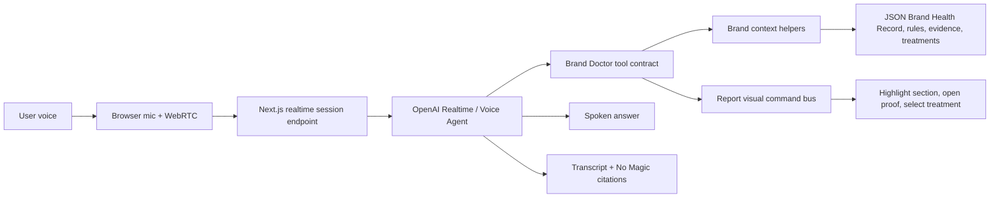

# Live Consult Wow Plan

Last updated: 2026-06-11

## Implementation Status

Phase 1 is implemented as a brand-scoped Live Consult spike on the report route. The app now has:

- JSON-backed consult scenarios and visual action definitions.
- A server-side OpenAI Realtime session endpoint that keeps the API key off the browser.
- A floating Live Consult panel with Realtime voice, browser voice fallback, prompt chips, transcript states, and No Magic context.
- A default-off governed browser/demo fallback mode that routes fallback prompts through the explicit skill-routed `/api/chat` runtime, persists a local session, and shows transcript proof strips while Realtime voice and TTS remain gated.
- Allowlisted visual actions for opening sections, opening Rule & Evidence Trace, highlighting KPI modules, selecting the top treatment path, and creating a meeting-takeaway action stub.
- A lightweight premium doctor presence instead of a full video avatar vendor.
- `/agent-lab` as a separate governed Brand Growth Command Center slice using the new Brand Intelligence Packet, skill router, approved dynamic views, QBR story draft, and first Jarvis-style interaction pattern.

Still deferred:

- Unified `runAgentTurn()` runtime shared by Agent Lab, explicit skill-routed chat, governed brand chat opt-ins, and the default-off Live Consult browser/demo fallback. Full Realtime voice is still gated from runtime unification.
- `ExperiencePlan` contract so voice can assemble role-specific workspaces instead of only driving fixed report actions.
- Streaming event model for partial answer, evidence spotlight, dynamic view requests, guardrails, artifacts, and memory updates.
- Full video avatar vendor spike.
- Persistent transcript storage.
- Rich citation chips inside each spoken answer.
- Meeting takeaway export.

## Product Idea

Create a "Brand Doctor Live Consult" mode: a brand-scoped voice conversation that lets a user sit back, ask questions out loud, and watch the Brand Doctor move through the report, evidence, diagnosis, prescription path, or a generated role-specific command workspace on screen.

The wow is not only speech. The wow is voice plus proof plus adaptive workspace. The user asks, "Prove it," and the product opens the rule trace, highlights the evidence, and explains what came from data, what came from deterministic logic, and what the AI interpreted. The user asks, "Build me the CMO QBR view," and the product creates an inspectable `ExperiencePlan` that renders approved views and artifacts with human-review gates.

## Demo Moment

Primary demo script:

1. User opens `/brand/dots`.
2. User clicks "Live Consult."
3. Brand Doctor appears as a small executive consult panel.
4. User says, "Give me the boardroom version."
5. Brand Doctor gives a concise spoken diagnosis and opens the executive summary.
6. User says, "Why do you believe that?"
7. Brand Doctor opens Current Diagnosis and the Rule & Evidence Trace.
8. User says, "Show me the weak point."
9. Brand Doctor highlights the KPI section and calls out matched, missing, and counter evidence.
10. User says, "What should we test first?"
11. Brand Doctor opens Prescription & Action Plan, selects the top-ranked treatment path, and explains caveats.
12. User says, "Leave me with the decision."
13. Brand Doctor summarizes decision, evidence, risk, and next follow-up signals.

The audience should feel that the system is an expert advisor, not a dashboard wrapper.

## Why It Fits Brand Doctor

- The doctor/patient metaphor becomes literal: the brand can be discussed in a consult, not only inspected.
- It reinforces "No Magic" because the spoken assistant can drive users to the exact evidence and rules.
- It reduces keyboard friction in stakeholder demos and workshops.
- It makes skepticism productive: "Prove it" becomes a first-class voice command.
- It can later support market, portfolio, and system views without changing the core brand-specific V1.

## Recommended Build Strategy

### Phase 0 - Design The Contract First

Do before adding runtime dependencies.

Deliverables:

- `src/data/config/live-consult-scenarios.json`
- `src/data/config/voice-consult-actions.json`
- `src/lib/live-consult/context.ts`
- `src/lib/live-consult/actions.ts`

Define the spoken consult around a small command contract:

- `navigate_to_section`
- `highlight_metric`
- `open_rule_trace`
- `open_no_magic`
- `show_evidence_item`
- `show_counter_evidence`
- `select_treatment_path`
- `open_follow_up_signals`
- `create_meeting_takeaway`
- `stop_consult`

This keeps the avatar/voice layer from becoming another place where diagnosis or treatment logic gets invented.

### Phase 1 - Voice Consult Without Avatar

Build the fast proof first.

Experience:

- Add a "Live Consult" button to `/brand/[brandId]` and `/brand/[brandId]/conversation`.
- Open a floating consult panel with mic state, transcript, current source context, and a "No Magic" drawer.
- Let the user speak naturally.
- Have the assistant answer by voice.
- Drive the page with visual actions through the command contract.

Recommended technology:

- OpenAI Realtime voice through the Agents SDK or lower-level Realtime WebRTC.
- Install path to test first: `pnpm add @openai/agents zod`
- Narrower alternative if the app only needs browser voice: `pnpm add @openai/agents-realtime zod`

Why this first:

- OpenAI docs position speech-to-speech live audio sessions as the right path for natural, low-latency voice conversations.
- Browser voice agents should generally use WebRTC, with a server endpoint creating the session/client secret so the OpenAI API key stays on the server.
- The existing app already has brand context, personas, rules, evidence, and treatment rankings. Voice should call those same source helpers.

### Phase 2 - Premium "Doctor Presence"

Add a polished visual presence without committing to a video avatar vendor yet.

Experience:

- Floating Brand Doctor panel with voice-reactive motion, status states, and persona identity.
- States: listening, thinking, speaking, citing evidence, opening proof, paused.
- Optional transcript strip with citation chips.
- No human-like face yet. Keep it premium, executive, and non-gimmicky.

Recommended technology:

- CSS/React audio-reactive component.
- Native Web Audio API for input/output level visualization.
- No new vendor dependency.

Why this matters:

- It gives stage presence and delight while preserving full control.
- It avoids uncanny-valley risk during early stakeholder demos.
- It keeps latency simpler while we prove the consult flow.

### Phase 3 - Video Avatar Spike

Evaluate a true avatar only after Phase 1 works end to end.

Options to spike:

1. Tavus CVI
   - Best fit for a real-time, face-to-face consult.
   - Tavus describes CVI as a WebRTC-based conversational video interface with Persona, Replica, and Conversation concepts.
   - Spike question: can we keep Brand Doctor's existing OpenAI/context/tool contract as the brain, or must Tavus own too much of the LLM layer?

2. HeyGen
   - Strong fit for polished video/avatar generation and potentially hosted video-agent experiences.
   - Spike question: is the interactive latency and tool-control path strong enough for live evidence navigation, or is it better for scripted/polished readouts?

3. Custom lightweight avatar
   - Best fit for control, lowest procurement friction, and a prototype-safe executive presence.
   - Spike question: is a premium audio-reactive presence enough wow without a photoreal person?

Evaluation criteria:

- End-to-end latency
- Barge-in/interruption handling
- Ability to call our visual actions
- Ability to preserve "No Magic" citations
- Data/privacy posture
- Procurement friction
- Cost per demo minute
- Embedding quality inside the existing report UI

## Architecture



Server responsibilities:

- Create Realtime sessions or ephemeral client secrets.
- Keep OpenAI API keys server-side.
- Provide brand-scoped context packets.
- Register safe tool/action schemas.
- Log optional demo transcripts only if enabled.

Client responsibilities:

- Request mic permission.
- Connect to the voice session.
- Render consult panel state.
- Execute approved visual actions.
- Show transcript and No Magic citations.
- Let the user stop/pause immediately.

## Guardrails

- Voice consult must remain brand-specific for V1.
- Voice cannot invent diagnoses, treatments, metrics, or source evidence.
- Voice can explain, challenge, summarize, and translate.
- Visual actions must be allowlisted.
- All answers must be able to expose No Magic citations.
- If evidence is missing, the assistant says so and can open the data view.
- Perceived Value caveat remains in force: broad brand-equity value perception only, not SKU price guidance.
- Microphone is opt-in. No recording persistence by default.

## Install And Config Candidates

Installed for Phase 1:

```bash
pnpm add @openai/agents openai zod
```

Possible environment variables:

```bash
OPENAI_API_KEY=...
LIVE_CONSULT_ENABLED=true
LIVE_CONSULT_MODEL=gpt-realtime
LIVE_CONSULT_VOICE=marin
LIVE_CONSULT_RECORD_TRANSCRIPTS=false
TAVUS_API_KEY=...
TAVUS_REPLICA_ID=...
HEYGEN_API_KEY=...
```

Keep avatar vendor keys optional and out of the first voice-only build.

## Prototype Acceptance Criteria

Phase 1 is successful when:

- [x] User can start and stop a live consult.
- [x] User can use at least six consult prompts without typing.
- [x] Assistant can answer through Realtime voice or browser voice fallback and show transcript state.
- [x] Assistant can navigate to Executive Summary, Current Diagnosis, Rule Trace, Prescription & Action Plan, and Follow-Up Signals through allowlisted actions.
- [x] Every consult exposes No Magic source context in the panel.
- [x] Unsupported questions are constrained by the same brand-scoped packet and guardrails as Dialog With Data.
- [x] No API key is exposed to the browser.
- [x] Browser QA passes desktop and 390px mobile.

Phase 3 avatar spike is successful when:

- Avatar can be embedded inside the app without taking over the whole experience.
- Avatar can preserve the same No Magic / visual-action contract.
- Latency feels acceptable in a stakeholder demo.
- The avatar improves trust or memorability rather than distracting from evidence.

## Additional Wow Ideas To Pair With Voice

### Evidence Spotlight

The assistant highlights the exact KPI, rule condition, evidence row, or caveat while speaking. This should be part of Phase 1.

### Skeptic Mode

User says, "Challenge your own diagnosis." The assistant opens counter-evidence, missing evidence, and confidence caveats.

### Persona Debate

CMO Advisor and Insights Skeptic give short contrasting takes, then Brand Doctor reconciles the path forward. This is powerful for workshops but should come after the single-agent consult works.

### Diagnosis Playback

A narrated playback walks through context, KPI pattern, rule fired, evidence, caveats, treatment options, and follow-up proof.

### Meeting Takeaway

At the end, the assistant produces a review-required takeaway draft with the provisional decision, proof, caveat, unresolved gap, and next signal to monitor. The first governed slice exists in Agent Lab as `live-meeting-capture` / `meeting_takeaway_panel`; final export or circulation stays disabled until governance approves it.

## Source Notes

- OpenAI Voice Agents guide: https://developers.openai.com/api/docs/guides/voice-agents
- OpenAI Realtime WebRTC guide: https://developers.openai.com/api/docs/guides/realtime-webrtc
- OpenAI Realtime and audio overview: https://developers.openai.com/api/docs/guides/realtime
- OpenAI Agents SDK TypeScript: https://openai.github.io/openai-agents-js/
- Tavus CVI overview: https://docs.tavus.io/sections/conversational-video-interface/overview-cvi
- Tavus CVI FAQ: https://docs.tavus.io/sections/conversational-video-interface/faq
- HeyGen developer docs: https://developers.heygen.com/
